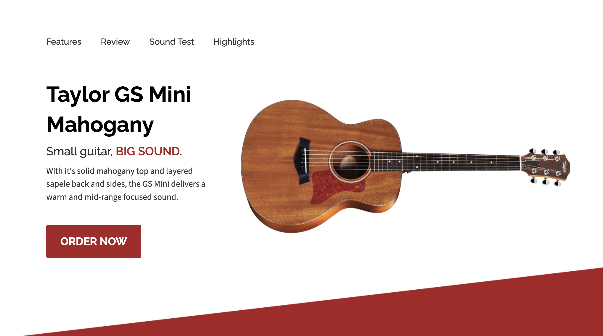
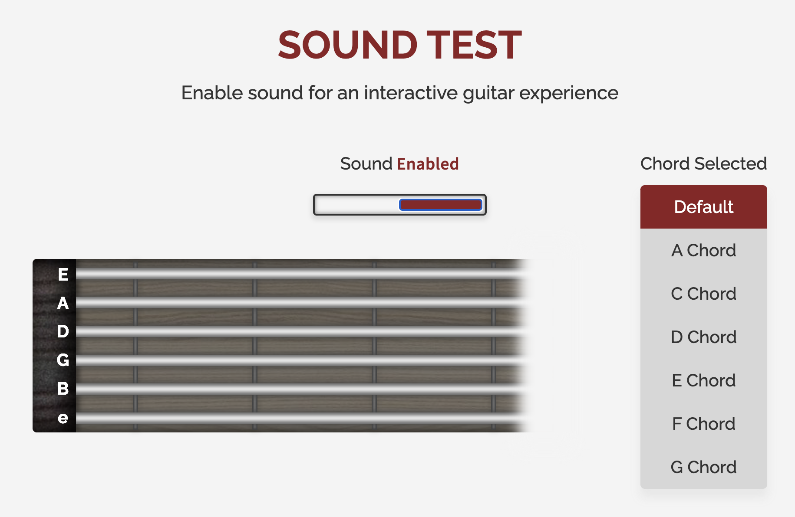

# GS Mini Mahogany Mock Product Site

Welcome to my GS Mini Mahogany mock site!

With a great design and a fully-playable guitar, this mock site strives to showcase my favorite guitar in a clear and interactive way.

<a href="https://taylor-mini-mahogany.netlify.app/" target="_blank">🎸 Check it out here!</a>

---

_Hero Section_

---

# Features

**-Smooth Page Animations (Site load and scroll)**

**-A fully interactive guitar model with sounds recorded from the Taylor GS Mini guitar (home recorded)**

_The guitar and its sounds can be enabled or disabled_

_On mouse hover over the guitar strings, the corresponding sounds will play_

_Changing the chord of the guitar will change what sounds the guitar plays!_

---

## Technologies Used:

HTML

Sass

Javascript

---

## Design Tools Used:

Figma

---
